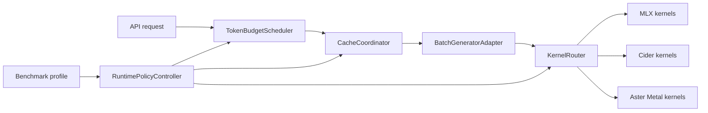

# Aster Core Inference Performance Design

**Status:** Proposed for implementation

**Target machine:** Apple M5 MacBook Pro, 10-core GPU, 24 GB unified memory,
Metal 4, macOS 27.0

## Objective

Make Aster's core MLX inference path measurably faster and more efficient for
long-context agent workloads on the target machine. The work must improve real
end-to-end inference rather than add unverified feature flags.

Every optimization is selected by benchmark data for the active model,
request shape, context length, concurrency, memory pressure, thermal state, and
power source. Unsupported or regressing paths fall back automatically.

## Scope

This design covers:

- a production continuous-batching runtime based on `mlx_lm.BatchGenerator`
- token-budget scheduling with chunked prefill and decode prioritization
- long-context KV and prefix-cache lifecycle management
- optional Cider and Aster Metal kernel routing
- hardware, memory, thermal, and power-aware policy selection
- reproducible performance, quality, stability, and energy gates

## Non-Goals

The first implementation does not:

- integrate PrismML/Bonsai models or new external quantization formats
- replace MLX model definitions with a fully independent graph runtime
- depend on private Apple APIs or attempt to bypass macOS GPU firmware
- enable lossy KV compression, speculative decoding, or custom kernels without
  model-specific validation
- expand provider APIs, multimodal features, or unrelated service surfaces

## Current Baseline

The local MLX-LM baseline for Qwen3.5-9B 4-bit is:

| Workload | Prefill tok/s | Decode tok/s | Peak MLX memory |
| --- | ---: | ---: | ---: |
| 1K prompt, batch 1 | 753.6 | 25.55 | 6.12 GB |
| 8K prompt, batch 1 | 775.1 | 24.44 | 6.58 GB |
| 32K prompt, batch 1 | 637.5 | 21.01 | 8.19 GB |
| 1K prompt, batch 2 | 827.1 | 50.59 | 6.64 GB |

MLX reports a maximum recommended working set of about 17.8 GiB on this
machine. The runtime must reserve headroom for the OS, request metadata,
temporary graphs, and cache growth rather than treating all 24 GB as available.

The existing `BatchedEngine` demonstrates the intended integration but is not
production-ready. Chunked prefill is disabled because of an MLX-LM API
mismatch, generator limits are derived from fixed request counts, cache state
is extracted during decode, and broad exception handlers can hide failed work.

## Architecture

The public API continues to depend on the existing inference-engine contract.
The high-performance data plane is split into focused internal components:

1. `BatchGeneratorAdapter` owns all version-sensitive MLX-LM calls.
2. `TokenBudgetScheduler` selects admissions, prefill chunks, and decode work.
3. `CacheCoordinator` owns live KV, reusable prefixes, and eviction decisions.
4. `KernelRouter` selects MLX, Cider, or Aster Metal implementations by shape.
5. `RuntimePolicyController` applies machine-specific benchmark profiles.
6. `BenchmarkRunner` produces comparable performance and quality records.

The manual engine remains a correctness fallback until the batched path passes
all compatibility and stability gates.

## Runtime Data Flow

1. Validate and tokenize the request before admission.
2. Estimate model, temporary graph, and KV memory for the requested token cap.
3. Match the longest reusable prefix under the model fingerprint and cache
   format namespace.
4. Admit requests only when the active token and memory budgets permit them.
5. Process long prompts in bounded prefill chunks, yielding between chunks when
   decode work is waiting.
6. Merge compatible decode requests by model, cache representation, sampling
   constraints, and shape bucket.
7. Route each kernel only through a profile validated for that exact capability
   class. Missing profiles use MLX.
8. Publish token, latency, memory, fallback, and energy counters without copying
   full cache state on the hot path.
9. Return completed cache ownership to the coordinator for reuse or eviction.

## Continuous Batching And Scheduling

Scheduling is based on token and memory budgets, not only request counts.

- Decode receives bounded priority to protect inter-token latency.
- Prefill proceeds in configurable chunks and yields at chunk boundaries.
- Idle periods may use larger prefill chunks for maximum throughput.
- Under decode pressure, prefill chunks shrink and new admissions pause.
- Requests receive explicit states and deadlines; cancellation is checked before
  and after every MLX synchronization boundary.
- Shape-compatible requests may batch together. Incompatible samplers or cache
  layouts remain separate rather than forcing expensive conversion.
- Admission reserves estimated peak bytes plus machine-specific headroom.
- Starvation is prevented with request age and accumulated-yield accounting.

The adapter must use feature detection for MLX-LM APIs. It must not use broad
exception handling to infer capabilities.

## Cache Design

The cache coordinator separates logical prefix indexing from physical MLX cache
ownership.

- Prefixes are indexed by model fingerprint, token chain, cache class, dtype,
  quantization settings, and position semantics.
- A radix or block-chain index provides longest-prefix lookup without scanning
  stored token tuples.
- Prefix hits share immutable cache blocks. Mutable decode tails use explicit
  copy-on-write.
- Hybrid and linear-attention model state is represented separately from normal
  full-attention KV. The runtime never assumes all layers have tuple K/V state.
- Pinned agent prefixes are budgeted separately from opportunistic entries.
- Eviction uses recomputation cost, size, recency, hit count, and pin state.
- SSD snapshots are a later cold tier for session recovery, not part of the
  per-token decode path.
- Cache statistics report bytes, reusable tokens, copy volume, lookup latency,
  and eviction reason.

Lossy KV quantization is disabled by default. A future profile may enable it
only after long-context quality and kernel-speed gates pass.

## Kernel Routing

MLX remains the universal fallback. Optional kernels register capabilities
rather than monkey-patching global functions.

The first Cider candidates are:

- decode SDPA for `Q=1`, supported head dimensions, and unmasked compatible
  attention
- long-sequence two-pass SDPA with machine-specific block autotuning
- M5 W4A8/W8A8 paths only for model layouts that can use the format without
  runtime weight conversion

The first Aster Metal candidates are limited to hot operations with measured
dispatch or memory overhead, such as fused KV quantize-and-write, layout-aware
decode attention, or sampler fusion. Kernels are prebuilt or cached before a
measured run. A first-request JIT penalty is never hidden inside steady-state
throughput.

Fast or relaxed math is permitted only where token parity and numerical tests
prove that special-value behavior is preserved.

## Hardware And Power Policy

The machine profile records:

- chip and GPU architecture
- OS, Python, MLX, MLX-LM, compiler, and Metal toolchain versions
- recommended working set and configured wired-memory limit
- power source, low-power mode, thermal pressure, and memory pressure

Three runtime policies are supported:

- `burst`: minimize TTFT and maximize short-run throughput
- `sustained`: maximize stable throughput without thermal collapse
- `efficiency`: minimize joules per successful token under a latency ceiling

The controller adjusts only application-level choices such as batch size,
prefill chunk, admission, cache tier, and kernel route. It does not claim to
control Apple GPU clocks or firmware scheduling.

Power measurements use `powermetrics` for CPU, GPU, ANE, and DRAM estimates,
plus wall-clock duration and completed tokens. Because `powermetrics` requires
privilege, benchmark setup must provide an explicit local collection path and
must still run performance tests when energy collection is unavailable.

## Benchmark Matrix

Each candidate is compared against the same warmed baseline in randomized
order. Records include raw trials, median, p50/p95/p99, dispersion, and software
and hardware fingerprints.

Required workloads are:

- cold single request: 512/128 and 2K/256 prompt/output tokens
- long context: 8K, 32K, and the largest validated model context
- prefix reuse: shared system/tool prefixes with divergent agent turns
- mixed scheduling: long prefill requests interleaved with short decode work
- concurrency: 1, 2, 4, 8, and memory-limited saturation
- cancellation and timeout during prefill and decode
- 30-minute sustained generation for thermal and energy behavior
- cache churn with multiple independent agent sessions

Primary metrics are TTFT, inter-token latency, prefill tok/s, decode tok/s,
aggregate tok/s, request p95/p99, peak MLX memory, RSS, swap growth, cache reuse,
joules per token, and successful tokens per joule.

## Quality And Correctness Gates

Lossless runtime changes must preserve exact greedy token output for fixed
inputs and seeds. Kernel-level tests compare against MLX reference tensors using
dtype-appropriate tolerances before token-level parity tests.

Lossy candidates must additionally pass:

- perplexity or log-likelihood deltas on a fixed corpus
- long-context retrieval and needle tests
- multi-turn tool-call and structured-output validity
- reasoning, math, and code task subsets
- prefix reuse equivalence against cold execution

No optimization may improve throughput by silently reducing generated tokens,
changing finish reasons, skipping prompt work, or increasing request failures.

## Performance Gates

A candidate may become a default profile only when:

- at least seven measured trials follow two discarded warmups
- the median target metric improves by at least 5 percent
- the 95 percent bootstrap confidence interval for the improvement excludes zero
- TTFT and inter-token p95 do not regress by more than 3 percent in protected
  workloads
- request success, token counts, and quality gates remain unchanged for
  lossless paths
- peak memory does not grow by more than 5 percent unless the accepted profile
  has an explicitly documented capacity tradeoff
- sustained joules per token do not regress by more than 3 percent

Experimental profiles may be retained behind explicit opt-in when they help a
narrow workload but fail the default-profile gates.

## Failure Handling

- Capability detection happens at startup and produces structured diagnostics.
- Unsupported kernel shapes fall back before dispatch.
- Runtime kernel failures quarantine that profile for the process and retry the
  request on MLX when cache state remains valid.
- Invalid or partially advanced cache state fails the request rather than being
  reused.
- Memory pressure pauses admission, evicts unpinned caches, and then rejects
  requests with an actionable error instead of relying on system swap.
- Benchmark and autotune records are written atomically and ignored when their
  machine or software fingerprint does not match.

## Implementation Sequence

1. Establish the versioned benchmark record and capture a clean Aster baseline.
2. Extract `BatchGeneratorAdapter` and make continuous batching pass API,
   lifecycle, cancellation, and compatibility tests.
3. Replace request-count scheduling with token and memory budgets; enable
   chunked prefill through the adapter.
4. Remove hot-path cache extraction and connect physical cache ownership to the
   coordinator.
5. Add radix/block prefix indexing and hybrid-cache-safe namespaces.
6. Add hardware profiles and benchmark-gated autotune.
7. Install and validate the Metal toolchain, then integrate Cider through the
   capability router.
8. Add only those Aster Metal kernels justified by profiler evidence.
9. Add sustained power and thermal policy selection.

Each sequence item is independently benchmarked and may be rejected without
blocking later work that does not depend on it.

## Acceptance Criteria

The first core release is accepted when:

- the batched runtime is the fastest stable Aster path for concurrency 1 and 2
  on Qwen3.5-9B
- 32K mixed-agent workloads show a statistically significant improvement in at
  least one of TTFT, decode throughput, or short-request p95 without regressing
  the other protected metrics beyond their gates
- the full Aster test suite and compatibility harness pass
- repeated prefix workloads demonstrate real prefill tokens avoided
- a 30-minute sustained run completes without unbounded memory growth,
  generator stalls, thermal-collapse oscillation, or silent request loss
- benchmark artifacts contain enough hardware, software, workload, quality,
  and energy metadata to reproduce the decision

